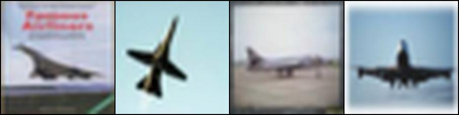

# CBIR-pytorch
Content-based Image Retrieval in PyTorch

## Run
```bash
python3 main.py --output output --runname cifar10
```
The corresponding image can be found at `./output`

## Result





The results are not quite good because of
1. The pretrained VGG-19 is trained on ImageNet database
2. The pretrained VGG-19 needs the input to be 3\*224\*224, but CIFAR10 only gets 32\*32

It is better to train the Image Classifer for your own dataset